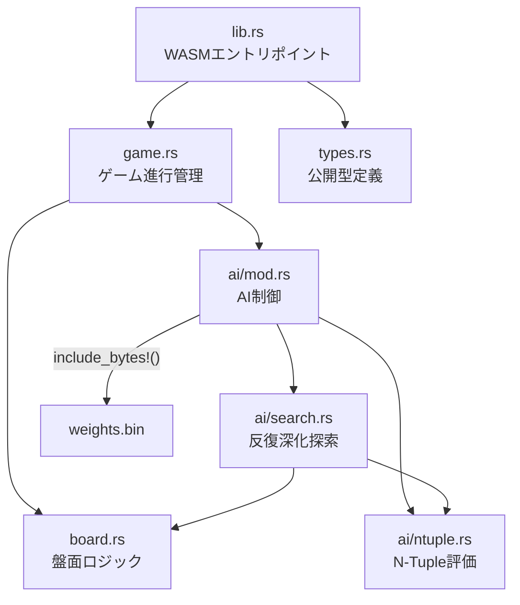
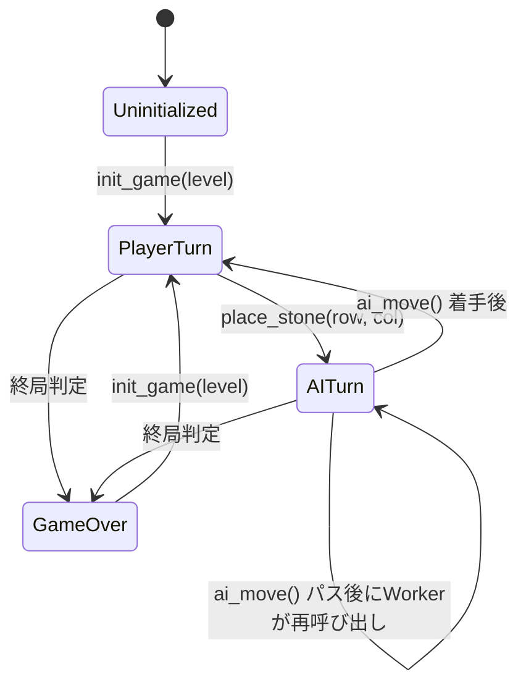
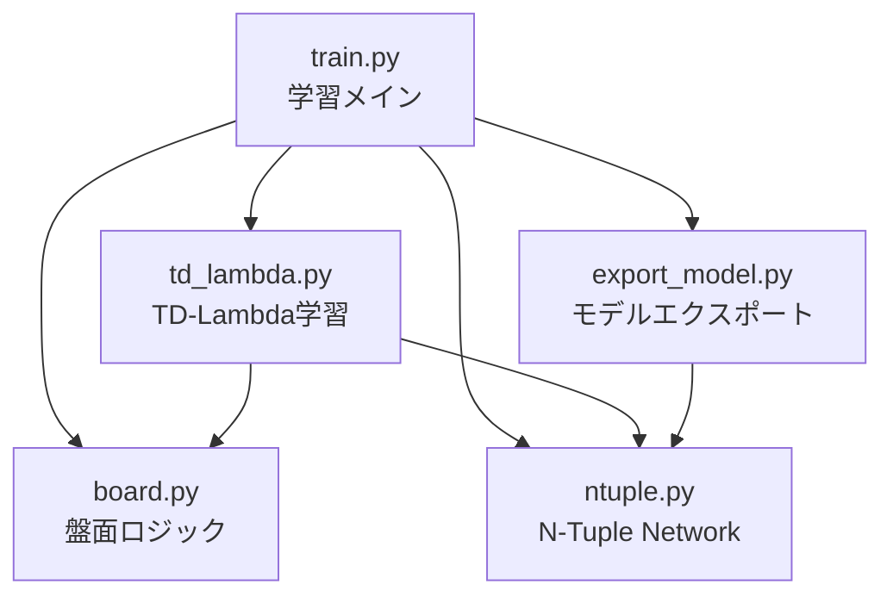
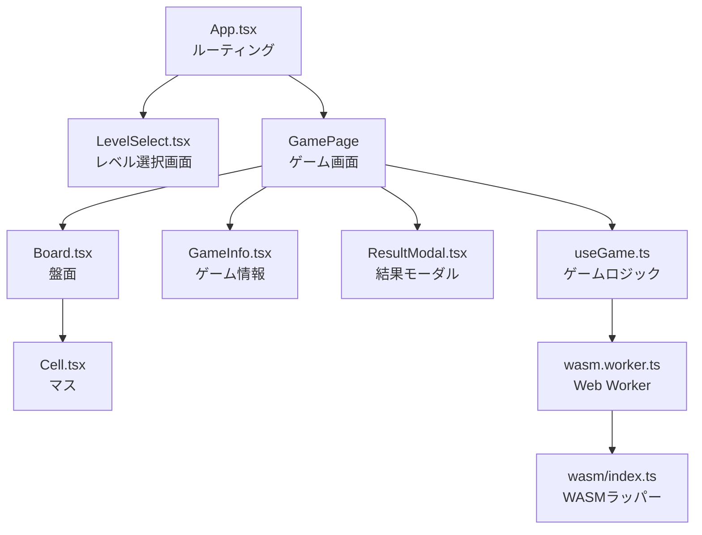
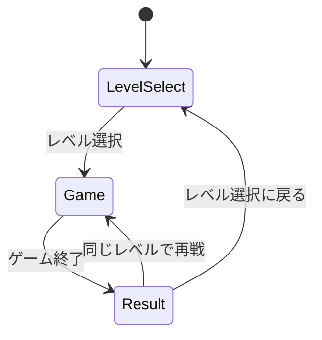
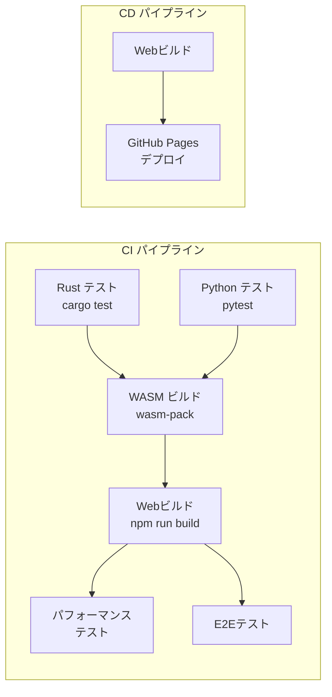

# オセロAIシステム 設計書

## 1. 設計方針

本設計書は [REQUIREMENTS.md](./REQUIREMENTS.md) に基づき、
Rust（ゲームエンジン + AI推論）、Python（AI学習）、TypeScript + React（Web UI）の3コンポーネントの
詳細設計を定義する。

### 1.1 設計原則

- SRP: 各モジュールは単一の責務を持つ
- DRY: Python学習用とRust推論用のN-Tupleロジックは、同一仕様に基づき各言語で独立実装する
- KISS: 初期版はシングルトン方式で最小構成とする

## 2. Rust ゲームエンジン設計

### 2.1 モジュール構成



### 2.2 board.rs: 盤面ロジック

#### ビットボード表現

```rust
/// 盤面をビットボードで表現
/// 各ビットが8×8盤面の1マスに対応（bit0=a1, bit63=h8）
pub struct Board {
    /// 黒石のビットマスク
    black: u64,
    /// 白石のビットマスク
    white: u64,
}
```

```text
ビット配置（row-major, 左上起点）:

     a  b  c  d  e  f  g  h
  1 [ 0][ 1][ 2][ 3][ 4][ 5][ 6][ 7]
  2 [ 8][ 9][10][11][12][13][14][15]
  3 [16][17][18][19][20][21][22][23]
  4 [24][25][26][27][28][29][30][31]
  5 [32][33][34][35][36][37][38][39]
  6 [40][41][42][43][44][45][46][47]
  7 [48][49][50][51][52][53][54][55]
  8 [56][57][58][59][60][61][62][63]

Position(row, col) → bit index: row * 8 + col
```

#### 公開API

```rust
impl Board {
    /// 初期盤面を生成（d4=白, e4=黒, d5=黒, e5=白）
    pub fn new() -> Self;

    /// 指定位置に着手し、反転処理を行う
    /// 戻り値: 反転した石のビットマスク（アニメーション用）
    pub fn place(&mut self, pos: usize, is_black: bool) -> u64;

    /// 指定プレイヤーの合法手ビットマスクを返す
    pub fn legal_moves(&self, is_black: bool) -> u64;

    /// 石数を返す
    pub fn count(&self) -> (u8, u8); // (black_count, white_count)

    /// 空きマス数を返す
    pub fn empty_count(&self) -> u8;

    /// 盤面をu8配列（64要素: 0=空, 1=黒, 2=白）に変換
    pub fn to_array(&self) -> [u8; 64];
}
```

#### 反転処理アルゴリズム

8方向（上下左右＋斜め4方向）のビットシフトで反転対象を検出する。

```rust
/// 方向ごとのシフト量とマスク
const DIRECTIONS: [(u32, u64); 8] = [
    (1, 0x7e7e7e7e7e7e7e7e),  // 左右（a列・h列をマスク）
    (8, 0xffffffffffffff00),  // 上下（1行目・8行目をマスク）
    (7, 0x7e7e7e7e7e7e7e00),  // 斜め（左上-右下）
    (9, 0x7e7e7e7e7e7e7e00),  // 斜め（右上-左下）
    // 逆方向4つ（符号反転）
    ...
];
```

### 2.3 game.rs: ゲーム進行管理

#### 状態管理

```rust
/// ゲーム全体の状態（シングルトン）
struct GameInstance {
    board: Board,
    current_player: u8,        // 1=黒(プレイヤー), 2=白(AI)
    level: u8,                 // 1〜6
    is_game_over: bool,
    is_pass: bool,             // 直前の操作がパスだったか
    flipped: Vec<u8>,          // 直前の着手で反転した石の位置
    ntuple: NTupleEvaluator,   // 学習済みN-Tuple評価関数
}
```

> [!NOTE]
> 内部状態の手番表現は `current_player: u8`（1=黒, 2=白）に統一する。
> `to_game_state()` でそのまま公開型 `GameState.current_player` へコピーする。
> `is_black` が必要な局面（探索・評価）では `current_player == 1` で導出する。

#### 状態遷移



#### パス処理の責務分担

`ai_move()` は1手分のみ実行する。連続パス時のループは Worker 側で管理する。

```text
Rust側 ai_move() の責務:
  - AI合法手あり → 探索 + place
    → 着手後、相手（プレイヤー）に合法手がない場合は自動パスして
       current_player をAIに戻す（F-05準拠）
    → その際、AIにも合法手がなければ両者パスで終局
  - AI合法手なし → パス処理（is_pass=true）。相手も合法手なしなら終局

Worker側の責務:
  - ai_move() を呼び出し、各結果を 'ai_step' として通知（反転アニメーション用）
  - 戻り値の current_player === 2 && !is_game_over なら再度 ai_move() を呼ぶ
  - current_player === 1（プレイヤー手番）または is_game_over で終了
```

#### 終局判定ロジック

```text
終局条件（いずれかを満たす場合）:
1. 盤面が全て埋まっている（empty_count == 0）
2. 両者連続パス（現手番に合法手なし かつ 相手にも合法手なし）
```

### 2.4 ai/ntuple.rs: N-Tuple評価関数

#### データ構造

```rust
/// N-Tuple評価関数
pub struct NTupleEvaluator {
    /// タプル定義: 各タプルのマス位置リスト
    tuples: Vec<Vec<u8>>,
    /// 重み配列: tuples[i] に対応する 3^tuple_size 個の重み
    weights: Vec<Vec<f32>>,
}
```

#### 評価フロー

```rust
impl NTupleEvaluator {
    /// weights.bin からデシリアライズ（CRC32検証付き）
    pub fn from_bytes(data: &[u8]) -> Result<Self, String>;

    /// 盤面を手番側視点（current player view）で評価する
    /// is_black=true なら黒にとって有利なほど正、is_black=false なら白にとって有利なほど正
    /// Negamax探索で符号反転と組み合わせて使用する
    /// 回転4対称変換（0/90/180/270度）を適用し、全タプルの重みを合算する
    pub fn evaluate(&self, board: &Board, is_black: bool) -> f32;
}
```

#### 回転4対称変換

```text
盤面に対して以下の4つの時計回り回転変換を適用し、各変換後のタプルインデックスで重みを引く:
1. 恒等変換（そのまま）
2. 90度回転
3. 180度回転
4. 270度回転

水平反転系（水平反転 + 0/90/180/270度回転）は、今回採用する
`TUPLE_PATTERNS` に鏡像相当のパターンを含めることで吸収する。

座標変換関数（90度時計回り）:
  rotate90_cw(row, col)  → (col, 7 - row)

Python実装では `np.rot90(board_grid, -k)` を使って同等の時計回り回転を生成する。
```

#### weights.bin デシリアライズ

```rust
pub fn from_bytes(data: &[u8]) -> Result<Self, String> {
    // 1. ヘッダ検証（20 bytes）
    //    - magic == "NTRV"
    //    - version == 1
    //    - num_tuples を読み取り
    //    - data_crc32 を読み取り

    // 2. CRC32 検証
    //    - data[20..] のCRC32を計算し、data_crc32 と比較

    // 3. タプル定義の読み取り
    //    - 各タプル: tuple_size(u8) + positions([u8; tuple_size])

    // 4. 重み配列の読み取り
    //    - 各タプル: 3^tuple_size 個の f32 (リトルエンディアン)

    // 5. データ長の整合性チェック
}
```

### 2.5 ai/search.rs: 反復深化Alpha-Beta探索

#### 探索構造

```rust
pub struct Searcher<'a> {
    evaluator: &'a NTupleEvaluator,
    start_time: Instant,
    timeout: Duration,          // 5秒
    max_depth: u8,              // レベル（1〜6）
    timed_out: bool,
}
```

#### 反復深化フロー

```rust
impl<'a> Searcher<'a> {
    /// 最善手を探索して返す
    pub fn search(&mut self, board: &Board, is_black: bool) -> usize {
        let legal = board.legal_moves(is_black);
        let moves = bitboard_to_positions(legal);

        // 合法手が1つなら即座に返す
        if moves.len() == 1 { return moves[0]; }

        let mut best_move = moves[0]; // 最低保証: 深度0の最初の合法手

        // 反復深化: 深度1からmax_depthまで
        for depth in 1..=self.max_depth {
            match self.negaalpha(board, is_black, depth, depth, MIN, MAX) {
                SearchResult::Complete(mv, _score) => best_move = mv,
                SearchResult::TimedOut => break,
            }
        }

        // 終盤完全読みチェック
        if self.should_exact_solve(board) && !self.timed_out {
            if let SearchResult::Complete(mv, _) =
                self.exact_solve(board, is_black) {
                best_move = mv;
            }
        }

        best_move
    }
}
```

#### NegaAlpha（Alpha-Beta）

```rust
fn negaalpha(
    &mut self,
    board: &Board,
    is_black: bool,
    depth: u8,
    root_depth: u8,  // 反復深化の現在の指定深度（深度1完了保証用）
    alpha: f32,
    beta: f32,
) -> SearchResult {
    // タイムアウトチェック（深度1を完了するまでは抑制）
    if root_depth > 1 && self.start_time.elapsed() > self.timeout {
        self.timed_out = true;
        return SearchResult::TimedOut;
    }

    // 深度0: 評価関数で葉ノード評価
    if depth == 0 {
        return SearchResult::Complete(
            0, self.evaluator.evaluate(board, is_black)
        );
    }

    let legal = board.legal_moves(is_black);

    // パス処理
    if legal == 0 {
        let opp_legal = board.legal_moves(!is_black);
        if opp_legal == 0 {
            // 両者パス→終局: 石差で評価
            return SearchResult::Complete(0, exact_score(board, is_black));
        }
        // 自分だけパス→相手番
        let result = self.negaalpha(board, !is_black, depth, root_depth, -beta, -alpha);
        return result.negate();
    }

    // 合法手をソート（評価値順。同評価値はインデックス昇順で安定ソート）
    let mut moves = bitboard_to_sorted_moves(legal, board, is_black, self.evaluator);

    let mut best_move = moves[0];
    let mut best_score = f32::NEG_INFINITY;
    let mut alpha = alpha;

    for mv in moves {
        let mut next = board.clone();
        next.place(mv, is_black);
        let result = self.negaalpha(&next, !is_black, depth - 1, root_depth, -beta, -alpha);

        match result {
            SearchResult::TimedOut => return SearchResult::TimedOut,
            SearchResult::Complete(_, score) => {
                let score = -score;
                // タイブレーク: 同スコアならインデックス昇順（要件2.4準拠）
                if score > best_score || (score == best_score && mv < best_move) {
                    best_score = score;
                    best_move = mv;
                }
                if score > alpha {
                    alpha = score;
                }
                if alpha >= beta {
                    break; // カット
                }
            }
        }
    }

    SearchResult::Complete(best_move, alpha)
}
```

#### 終盤完全読み

```rust
/// 完全読みの発動判定
fn should_exact_solve(&self, board: &Board) -> bool {
    let empty = board.empty_count();
    match self.max_depth {
        3 => empty <= 10,
        4 => empty <= 12,
        5 => empty <= 14,
        6 => empty <= 16,
        _ => false, // Level 1-2 は完全読みなし
    }
}

/// 完全読み（石差ベースのAlpha-Beta、deadline管理付き）
fn exact_solve(&mut self, board: &Board, is_black: bool) -> SearchResult {
    // deadlineチェック付きの完全読み
    // タイムアウト時は SearchResult::TimedOut を返し、
    // 呼び出し元の search() が反復深化の best_move にフォールバックする
    self.negaalpha_exact(board, is_black, board.empty_count(), MIN, MAX)
    // negaalpha_exact() 内部でも self.start_time / self.timeout を用いて
    // ノード展開毎にdeadline超過をチェックする
}
```

### 2.6 lib.rs: WASM公開API

> [!NOTE]
> WASM 境界では `serde_wasm_bindgen` で Rust 構造体を `JsValue` に変換して返す。
> API のシグネチャは全て `JsValue` / `Result<JsValue, JsValue>` とする。
> TypeScript 側の型安全性は `wasm/index.ts` のラッパーで型アサーションにより確保する。

```rust
use std::sync::Mutex;
use once_cell::sync::Lazy;

/// グローバルゲームインスタンス（シングルトン）
static GAME: Lazy<Mutex<Option<GameInstance>>> = Lazy::new(|| Mutex::new(None));

#[wasm_bindgen]
pub fn init_game(level: u8) -> Result<JsValue, JsValue> {
    if level < 1 || level > 6 {
        return Err(JsValue::from_str("レベルは1〜6で指定してください"));
    }

    let weights = include_bytes!("ai/weights.bin");
    let evaluator = NTupleEvaluator::from_bytes(weights)
        .map_err(|e| JsValue::from_str(&e))?;

    let instance = GameInstance::new(level, evaluator);
    *GAME.lock().unwrap() = Some(instance);

    // 格納後にロックから参照を取り直す
    let guard = GAME.lock().unwrap();
    let game = guard.as_ref().unwrap();
    Ok(serde_wasm_bindgen::to_value(&game.to_game_state())?)
}

#[wasm_bindgen]
pub fn get_legal_moves() -> Result<JsValue, JsValue> {
    let game = GAME.lock().unwrap();
    let game = game.as_ref().ok_or(JsValue::from_str("ゲーム未初期化"))?;
    Ok(serde_wasm_bindgen::to_value(&game.get_legal_moves())?)
}

#[wasm_bindgen]
pub fn place_stone(row: u8, col: u8) -> Result<JsValue, JsValue> {
    let mut guard = GAME.lock().unwrap();
    let game = guard.as_mut().ok_or(JsValue::from_str("ゲーム未初期化"))?;
    if game.is_game_over {
        return Err(JsValue::from_str("ゲームは終了しています"));
    }
    if game.current_player != 1 {
        return Err(JsValue::from_str("プレイヤーの手番ではありません"));
    }
    game.place(row, col).map_err(|e| JsValue::from_str(&e))?;
    Ok(serde_wasm_bindgen::to_value(&game.to_game_state())?)
}

#[wasm_bindgen]
pub fn ai_move() -> Result<JsValue, JsValue> {
    let mut guard = GAME.lock().unwrap();
    let game = guard.as_mut().ok_or(JsValue::from_str("ゲーム未初期化"))?;
    if game.is_game_over {
        return Err(JsValue::from_str("ゲームは終了しています"));
    }
    if game.current_player != 2 {
        return Err(JsValue::from_str("AIの手番ではありません"));
    }

    // 1手分のAI着手のみ実行（連続パスループはWorker側で管理）
    if !game.has_legal_moves_for_current() {
        // AI合法手なし → パス（is_pass=true をセット）
        game.pass();
        // 相手も合法手なしなら終局
        if !game.has_legal_moves_for_current() {
            game.end_game();
        }
    } else {
        game.do_ai_move(); // 探索 + place

        // F-05: プレイヤーに合法手がない場合は自動パスしてAI手番に戻す
        if !game.is_game_over && !game.has_legal_moves_for_current() {
            game.pass(); // プレイヤー自動パス → current_player が AI に戻る
            // 両者合法手なしなら終局
            if !game.has_legal_moves_for_current() {
                game.end_game();
            }
        }
    }

    Ok(serde_wasm_bindgen::to_value(&game.to_game_state())?)
}

#[wasm_bindgen]
pub fn get_result() -> Result<JsValue, JsValue> {
    let game = GAME.lock().unwrap();
    let game = game.as_ref().ok_or(JsValue::from_str("ゲーム未初期化"))?;
    if !game.is_game_over {
        return Err(JsValue::from_str("ゲームが未終了です"));
    }
    Ok(serde_wasm_bindgen::to_value(&game.to_game_result())?)
}
```

### 2.7 types.rs: 公開型定義

```rust
use serde::Serialize;

#[derive(Serialize)]
pub struct Position {
    pub row: u8,
    pub col: u8,
}

#[derive(Serialize)]
pub struct GameState {
    pub board: Vec<u8>,        // 64要素
    pub current_player: u8,    // 1=黒, 2=白
    pub black_count: u8,
    pub white_count: u8,
    pub is_game_over: bool,
    pub is_pass: bool,         // パス時: true、通常着手時: false
    pub flipped: Vec<u8>,      // 通常着手時: 反転石の位置リスト、パス時: 空配列([])
}

#[derive(Serialize)]
pub struct GameResult {
    pub winner: u8,            // 0=引き分け, 1=黒, 2=白
    pub black_count: u8,
    pub white_count: u8,
}
```

## 3. Python 学習パイプライン設計

### 3.1 モジュール構成



### 3.2 board.py: 盤面ロジック

Rustの `Board` と同等の機能をPythonで実装する。
学習時の自己対戦で使用する。

```python
class Board:
    """ビットボード盤面（Rust側と同一のビット配置）"""

    def __init__(self):
        self.black: int = 0x0000000810000000  # d5, e4
        self.white: int = 0x0000001008000000  # d4, e5

    def legal_moves(self, is_black: bool) -> int:
        """合法手ビットマスクを返す"""

    def place(self, pos: int, is_black: bool) -> int:
        """着手し、反転ビットマスクを返す"""

    def count(self) -> tuple[int, int]:
        """（黒石数, 白石数）を返す"""

    def empty_count(self) -> int:
        """空きマス数を返す"""

    def to_array(self, is_black: bool) -> np.ndarray:
        """盤面を手番側から見た64要素のndarrayに変換（0=空, 1=手番側, 2=相手側）"""

    def copy(self) -> 'Board':
        """深いコピーを返す"""
```

### 3.3 ntuple.py: N-Tuple Network

```python
class NTupleNetwork:
    """N-Tuple Network 評価関数"""

    # 実際に使用するタプルパターン定義（想定パターン数: 14）
    TUPLE_PATTERNS: list[list[int]] = [
        [0, 1, 8, 9, 10, 17, 18, 19, 26, 27],
        [0, 1, 8, 9, 18, 27, 36, 45, 54, 63],
        [0, 1, 2, 3, 8, 9, 10, 16, 17, 24],
        [0, 1, 2, 3, 4, 8, 9, 16, 24, 32],
        [0, 1, 2, 3, 4, 5, 6, 7, 9, 14],
        [0, 2, 3, 4, 5, 7, 10, 11, 12, 13],
        [1, 2, 3, 4, 5, 6, 10, 11, 12, 13],
        [0, 1, 2, 8, 9, 10, 16, 17, 18],
        [0, 1, 10, 19, 28, 37, 46, 55, 63],
        [8, 9, 10, 11, 12, 13, 14, 15],
        [16, 17, 18, 19, 20, 21, 22, 23],
        [24, 25, 26, 27, 28, 29, 30, 31],
        [1, 2, 11, 20, 29, 38, 47, 55],
        [3, 9, 12, 21, 30, 39, 54],
    ]

    def __init__(self):
        """全重みを0で初期化"""
        self.weights: list[np.ndarray] = [
            np.zeros(3 ** len(pattern), dtype=np.float32)
            for pattern in self.TUPLE_PATTERNS
        ]

    def evaluate(self, board: Board, is_black: bool) -> float:
        """盤面評価（回転4対称変換を適用して全タプルの重みを合算）"""
        score = 0.0
        board_array = board.to_array(is_black)
        for sym in NTupleNetwork._symmetries(board_array):
            for i, pattern in enumerate(self.TUPLE_PATTERNS):
                index = NTupleNetwork._pattern_index(sym, pattern)
                score += self.weights[i][index]
        return score

    def update(self, board: Board, is_black: bool, delta: float):
        """重みを更新する（deltaは学習率適用済みの更新量）"""
        board_array = board.to_array(is_black)
        for sym in NTupleNetwork._symmetries(board_array):
            for i, pattern in enumerate(self.TUPLE_PATTERNS):
                index = NTupleNetwork._pattern_index(sym, pattern)
                self.weights[i][index] += delta

    @staticmethod
    def _pattern_index(board_array: np.ndarray, pattern: list[int]) -> int:
        """パターンのマス状態から重みインデックスを計算（3進数変換）"""
        index = 0
        for pos in pattern:
            index = index * 3 + board_array[pos]
        return index

    @staticmethod
    def _symmetries(board_array: np.ndarray) -> list[np.ndarray]:
        """回転4対称変換を返す（Rust側と同一の変換）"""
```

### 3.4 td_lambda.py: TD-Lambda学習

```python
class TDLambdaTrainer:
    """TD-Lambda による自己対戦学習"""

    def __init__(
        self,
        ntuple: NTupleNetwork,
        alpha: float = 0.01,    # 学習率
        lambda_: float = 0.7,   # 適格度トレースの減衰率
        epsilon: float = 0.1,   # ε-greedy の探索率
    ):
        self.ntuple = ntuple
        self.alpha = alpha
        self.lambda_ = lambda_
        self.epsilon = epsilon

    def train(self, num_games: int):
        """指定局数の自己対戦で学習"""
        for game_idx in range(num_games):
            self._play_one_game()
            if (game_idx + 1) % 10000 == 0:
                print(f"Game {game_idx + 1}/{num_games}")

    def _play_one_game(self):
        """1局を自己対戦し、TD-Lambda で重み更新"""
        board = Board()
        is_black = True
        history: list[tuple[Board, bool]] = []

        # ゲームプレイ
        while True:
            legal = board.legal_moves(is_black)
            if legal == 0:
                if board.legal_moves(not is_black) == 0:
                    break  # 終局
                is_black = not is_black
                continue

            # ε-greedy で手を選択
            move = self._select_move(board, is_black, legal)
            history.append((board.copy(), is_black))
            board.place(move, is_black)
            is_black = not is_black

        # TD-Lambda 更新（逆順に遡る）
        self._update_weights(history, board)

    def _update_weights(self, history, final_board):
        """ゲーム終了後、TD-Lambda で逆順に重みを更新"""
        black_count, white_count = final_board.count()
        # 終局報酬: 黒視点で +1(勝ち) / 0(引分) / -1(負け)
        if black_count > white_count:
            reward = 1.0
        elif black_count < white_count:
            reward = -1.0
        else:
            reward = 0.0

        # 逆順に TD 誤差を伝播
        next_value = reward
        eligibility = 0.0

        for board, is_black in reversed(history):
            current_value = self.ntuple.evaluate(board, is_black)
            td_error = next_value - current_value
            eligibility = self.lambda_ * eligibility + 1.0

            # 重み更新（学習率適用済みの更新量を渡す）
            delta = self.alpha * td_error * eligibility
            self.ntuple.update(board, is_black, delta)

            next_value = -current_value  # 相手視点に反転
```

### 3.5 train.py: 学習メインスクリプト

```python
def main():
    parser = argparse.ArgumentParser()
    parser.add_argument("--games", type=int, default=500_000)
    parser.add_argument("--alpha", type=float, default=0.01)
    parser.add_argument("--lambda", type=float, default=0.7, dest="lambda_")
    parser.add_argument("--epsilon", type=float, default=0.1)
    parser.add_argument("--output", type=str, default="weights.bin")
    args = parser.parse_args()

    ntuple = NTupleNetwork()
    trainer = TDLambdaTrainer(ntuple, args.alpha, args.lambda_, args.epsilon)

    print(f"Training for {args.games} games...")
    trainer.train(args.games)

    print(f"Exporting model to {args.output}...")
    export_model(ntuple, args.output)
    print("Done.")
```

### 3.6 export_model.py: モデルエクスポート

```python
import struct
import zlib

def export_model(ntuple: NTupleNetwork, path: str):
    """N-Tuple重みをweights.binフォーマットで出力"""

    # データ部を先に構築
    data_buf = bytearray()

    # Tuple Definitions
    for pattern in ntuple.TUPLE_PATTERNS:
        data_buf.append(len(pattern))            # tuple_size: u8
        data_buf.extend(bytes(pattern))           # positions: [u8; size]

    # Weights
    for weights in ntuple.weights:
        for w in weights:
            data_buf.extend(struct.pack("<f", w))  # f32 リトルエンディアン

    # CRC32 計算
    data_crc32 = zlib.crc32(bytes(data_buf)) & 0xFFFFFFFF

    # ヘッダ構築（20 bytes）
    header = bytearray()
    header.extend(b"NTRV")                         # magic
    header.extend(struct.pack("<I", 1))             # version
    header.extend(struct.pack("<I", len(ntuple.TUPLE_PATTERNS)))  # num_tuples
    header.extend(struct.pack("<I", data_crc32))    # data_crc32
    header.extend(struct.pack("<I", 0))             # reserved

    # ファイル書き出し
    with open(path, "wb") as f:
        f.write(header)
        f.write(data_buf)
```

## 4. Web フロントエンド設計

### 4.1 コンポーネント構成



### 4.2 画面遷移



### 4.3 useGame.ts: ゲームロジックフック

```typescript
interface GameHook {
  // 状態
  gameState: GameState | null;
  legalMoves: Position[];
  isThinking: boolean;
  error: string | null;

  // アクション
  startGame: (level: number) => Promise<void>;
  placeStone: (row: number, col: number) => Promise<void>;
  restart: () => Promise<void>;
}

function useGame(): GameHook {
  const workerRef = useRef<Worker>();
  const [gameState, setGameState] = useState<GameState | null>(null);
  const [legalMoves, setLegalMoves] = useState<Position[]>([]);
  const [isThinking, setIsThinking] = useState(false);
  const [error, setError] = useState<string | null>(null);
  const levelRef = useRef<number>(1);

  // Worker初期化
  useEffect(() => {
    workerRef.current = new Worker(
      new URL('../workers/wasm.worker.ts', import.meta.url),
      { type: 'module' }
    );
    workerRef.current.onmessage = handleMessage;
    return () => workerRef.current?.terminate();
  }, []);

  // ...
}
```

### 4.4 wasm.worker.ts: Web Worker

```typescript
// Web Worker コンテキスト
import init, { init_game, get_legal_moves, place_stone, ai_move, get_result } from '../wasm';

let initialized = false;

self.onmessage = async (e: MessageEvent) => {
  const { type, payload } = e.data;

  if (!initialized) {
    await init();
    initialized = true;
  }

  try {
    switch (type) {
      case 'init_game':
        const state = init_game(payload.level);
        const moves = get_legal_moves();
        self.postMessage({ type: 'game_state', payload: { state, moves } });
        break;

      case 'place_stone':
        const newState = place_stone(payload.row, payload.col);
        if (newState.is_game_over) {
          const result = get_result();
          self.postMessage({ type: 'game_over', payload: { state: newState, result } });
        } else if (newState.current_player === 2) {
          // AI 手番: 連続パスループをWorker側で管理
          // ai_move() は1手分のみ実行
          let currentState = newState;
          while (currentState.current_player === 2 && !currentState.is_game_over) {
            const aiState = ai_move();
            // 各AI着手の反転アニメーション用状態を通知
            self.postMessage({ type: 'ai_step', payload: { state: aiState } });
            currentState = aiState;
          }
          if (currentState.is_game_over) {
            const result = get_result();
            self.postMessage({ type: 'game_over', payload: { state: currentState, result } });
          } else {
            const aiMoves = get_legal_moves();
            self.postMessage({ type: 'game_state', payload: { state: currentState, moves: aiMoves } });
          }
        } else {
          const nextMoves = get_legal_moves();
          self.postMessage({ type: 'game_state', payload: { state: newState, moves: nextMoves } });
        }
        break;

      case 'get_result':
        const gameResult = get_result();
        self.postMessage({ type: 'result', payload: gameResult });
        break;
    }
  } catch (err) {
    self.postMessage({ type: 'error', payload: String(err) });
  }
};
```

### 4.5 Reactコンポーネント詳細

#### Board.tsx

```typescript
interface BoardProps {
  board: number[];           // 64要素: 0=空, 1=黒, 2=白
  legalMoves: Position[];    // 着手可能マス
  flipped: number[];         // 反転された石（アニメーション用）
  isPlayerTurn: boolean;
  onCellClick: (row: number, col: number) => void;
}
```

#### Cell.tsx

```typescript
interface CellProps {
  value: number;             // 0=空, 1=黒, 2=白
  isLegal: boolean;          // 着手可能か
  isFlipped: boolean;        // 反転アニメーション対象か
  onClick: () => void;
}

// CSSクラスによる状態管理:
// .cell           - 基本スタイル
// .cell--black    - 黒石
// .cell--white    - 白石
// .cell--legal    - 着手可能マス（ハイライト）
// .cell--flipped  - 反転アニメーション中
```

#### 反転アニメーション

```css
.cell--flipped {
  animation: flip 0.4s ease-in-out;
}

@keyframes flip {
  0%   { transform: rotateY(0deg); }
  50%  { transform: rotateY(90deg); }
  100% { transform: rotateY(180deg); }
}
```

### 4.6 レスポンシブ設計

要件 NF-03（PC・スマートフォン対応）に対応するレイアウト規則。

| 画面幅 | レイアウト | 盤面サイズ |
|--------|-------------|------------|
| ≥ 768px (PC) | 横並び（盤面 + サイドパネル） | 固定 480px |
| < 768px (スマホ) | 縦積み（盤面上、情報下） | `min(100vw - 32px, 480px)` |

| 要素 | 仕様 |
|------|------|
| マス最小タップ領域 | 44px × 44px（モバイル操作性確保） |
| ブレークポイント | CSS `@media (max-width: 767px)` |
| 盤面縮尺 | CSS Grid + `aspect-ratio: 1` で正方形を維持 |
| 盤面最小幅 | 352px（44px × 8マス）を下回らない。画面幅 < 384px の端末では水平スクロールを許容する |

### 4.7 Vite設定（WASM統合）

```typescript
// vite.config.ts
import { defineConfig } from 'vite';
import react from '@vitejs/plugin-react';
import wasm from 'vite-plugin-wasm';

export default defineConfig({
  plugins: [react(), wasm()],
  base: '/Reversi/',  // GitHub Pages のサブパス
  build: {
    // NF-02準拠: 対象ブラウザを明示的に指定
    target: ['chrome80', 'edge80', 'firefox114', 'safari15'],
  },
  worker: {
    format: 'es',
  },
});
```

## 5. CI/CD 設計

### 5.1 GitHub Actions ワークフロー

#### test.yml（CI）

```text
トリガー: push / pull_request (main, develop)

ジョブ:
  1. rust-test:
     - cargo test (board, game, ai ユニットテスト)
  2. python-test:
     - pytest (ntuple, td_lambda, board ユニットテスト)
  3. wasm-build:
     - wasm-pack build
  4. web-build:
     - npm ci && npm run build
  5. performance-test (要件3.1準拠):
     - 計測環境: ubuntu-latest (4コアCPU, 16GB RAM)
     - 計測方法: Playwright ヘッドレスブラウザ上でWASMを実行
     - 局面生成: 固定シード(seed=42)で100局をランダムプレイ、各局から中盤局面（手数20〜40）を1つ抽出
     - ウォームアップ: Level 1 で 5局面を着手しJIT等の影響を排除
     - 計測: 100局面 × Level 1〜6 の全600着手から各レベルごとにp95を算出
     - 合格基準: 全レベルで p95 < 3秒
     - タイムアウト: 5秒超過時は探索打ち切り（3.3参照）
  6. wasm-integration-test:
     - wasm-pack build 後にヘッドレスブラウザ（Playwright）で WASM API 統合テスト
     - init_game → place_stone → ai_move → get_result の一連フロー
     - 対応テストケース: T-06, T-07, T-08, T-10, T-11, T-12, T-13
  7. wasm-size-check (NF-04):
     - wasm-pack build 後の `reversi_bg.wasm` を gzip 圧縮しサイズ検証
     - 閾値: gzip 後 10MB 以下、超過時は fail
  8. e2e-test:
     - Playwright で E2E テスト
     - PC viewport (1280×720) およびモバイル viewport (375×667) の両方で実行
```

#### テストケースID対応表

| テストID | 内容 | 担当CIジョブ |
|---------|------|-------------|
| T-01〜T-05 | 盤面ロジック・パス・終局 | rust-test |
| T-06 | 不正レベル値 | wasm-integration-test |
| T-07 | 全レベルAI着手 | wasm-integration-test |
| T-08 | AI決定性 | wasm-integration-test |
| T-09 | モデル整合性エラー | rust-test |
| T-10 | init_game再呼び出し | wasm-integration-test |
| T-11 | AIパス局面 | wasm-integration-test |
| T-12 | 完全読みタイムアウト | wasm-integration-test |
| T-13 | AI決定性（100回） | wasm-integration-test |

#### deploy.yml（CD）

```text
トリガー: push (main)

ジョブ:
  1. build:
     - wasm-pack build
     - npm ci && npm run build
  2. size-gate (NF-04):
     - reversi_bg.wasm の gzip 後サイズ ≤ 10MB を検証（失敗時はデプロイ中止）
  3. deploy:
     - GitHub Pages へデプロイ（gh-pages ブランチ）
```

### 5.2 ビルドパイプライン



## 6. ディレクトリ構成（設計確定版）

```text
Reversi/
├── docs/
│   ├── REQUIREMENTS.md
│   └── DESIGN.md                # 本ファイル
├── rust/
│   ├── Cargo.toml
│   ├── Cargo.lock
│   └── src/
│       ├── lib.rs               # WASM公開API（init_game, place_stone等）
│       ├── board.rs             # ビットボード盤面ロジック
│       ├── game.rs              # GameInstance, 状態遷移, パス/終局処理
│       ├── types.rs             # Position, GameState, GameResult
│       └── ai/
│           ├── mod.rs           # AI公開インターフェース
│           ├── ntuple.rs        # NTupleEvaluator, 回転4対称変換, weights.binデシリアライズ
│           ├── search.rs        # Searcher, 反復深化, NegaAlpha, 完全読み
│           └── weights.bin      # 学習済みモデル（include_bytes!対象）
├── python/
│   ├── requirements.txt         # numpy, pytest, ruff
│   ├── train.py                 # 学習エントリポイント（CLI引数: --games, --alpha等）
│   ├── board.py                 # Board クラス（Rust同等のビットボード）
│   ├── ntuple.py                # NTupleNetwork クラス（タプル定義, 評価, 更新）
│   ├── td_lambda.py             # TDLambdaTrainer クラス（自己対戦 + TD更新）
│   ├── export_model.py          # export_model() 関数（weights.bin出力 + CRC32）
│   └── tests/
│       ├── test_board.py
│       ├── test_ntuple.py
│       └── test_td_lambda.py
├── web/
│   ├── package.json
│   ├── tsconfig.json
│   ├── vite.config.ts
│   ├── index.html
│   └── src/
│       ├── main.tsx             # Reactエントリポイント
│       ├── App.tsx              # ルーティング（LevelSelect ↔ Game）
│       ├── components/
│       │   ├── Board.tsx        # 8×8盤面グリッド
│       │   ├── Cell.tsx         # 個別マス（石/空/ハイライト/反転アニメ）
│       │   ├── GameInfo.tsx     # 石数、手番、思考中インジケーター
│       │   ├── LevelSelect.tsx  # Level 1〜6 選択UI
│       │   └── ResultModal.tsx  # 結果表示モーダル
│       ├── hooks/
│       │   └── useGame.ts       # ゲームロジックフック（Worker管理）
│       ├── workers/
│       │   └── wasm.worker.ts   # Web Worker（WASM実行）
│       ├── wasm/
│       │   └── index.ts         # WASM連携ラッパー（型定義re-export）
│       ├── types/
│       │   └── game.ts          # TypeScript型定義（GameState等）
│       └── styles/
│           ├── index.css        # グローバルスタイル
│           ├── Board.module.css
│           ├── Cell.module.css
│           └── LevelSelect.module.css
├── .github/
│   └── workflows/
│       ├── test.yml
│       └── deploy.yml
├── AGENTS.md
└── README.md
```
