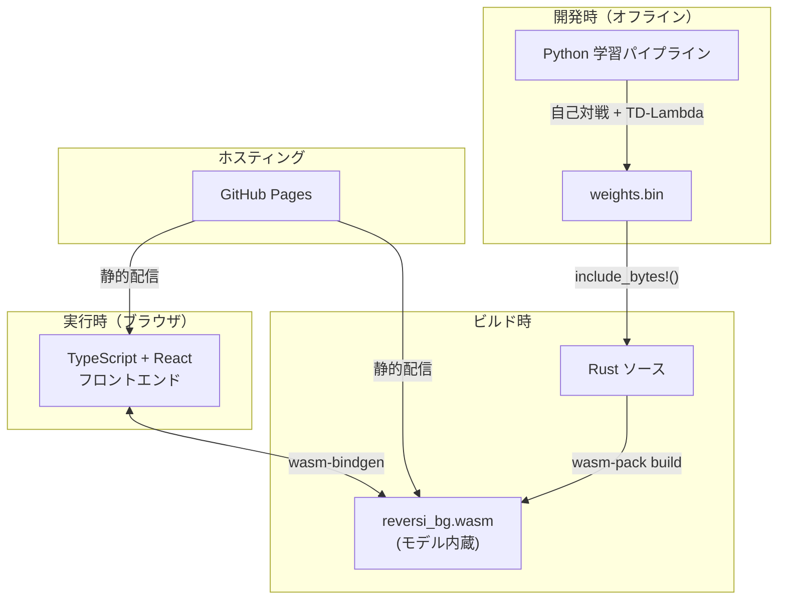
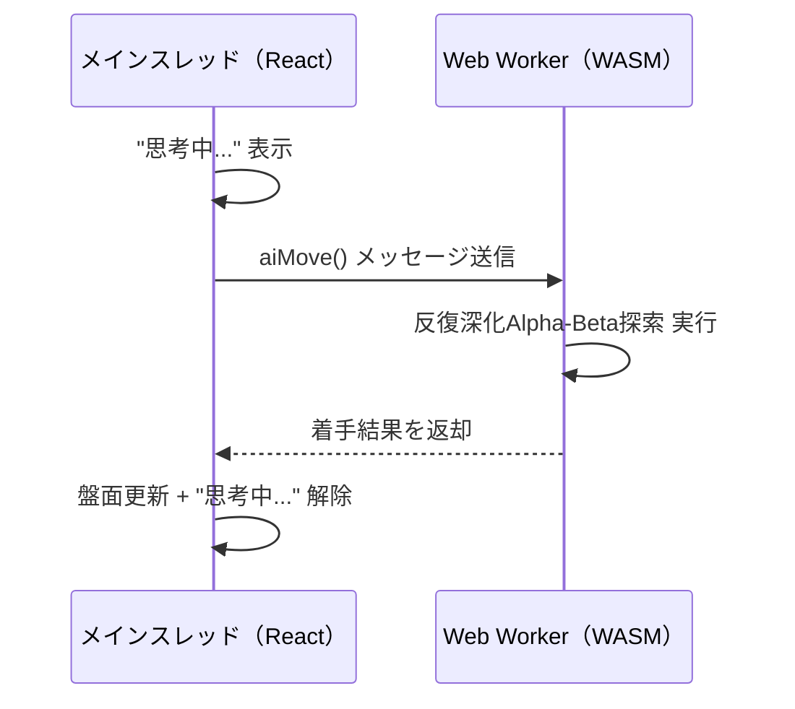
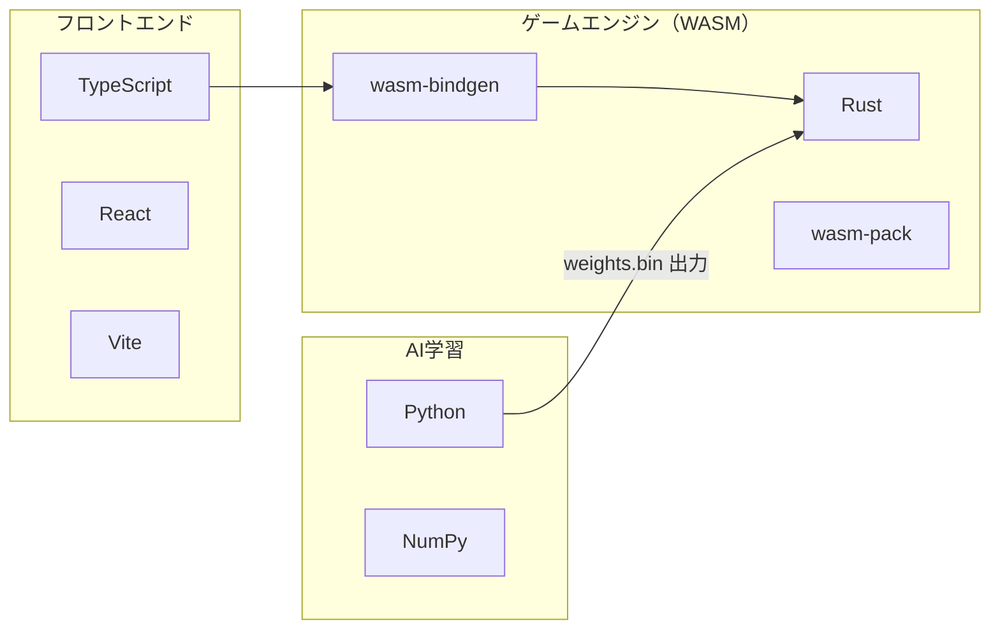
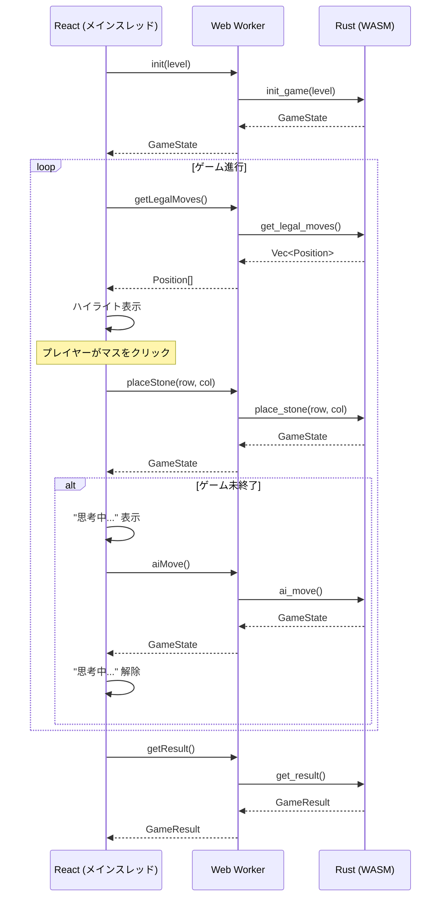
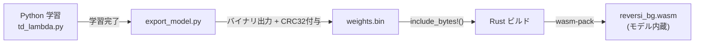

# オセロAIシステム 要件定義書

## 1. プロジェクト概要

### 1.1 目的

N-Tuple + TD-Lambda アルゴリズムを用いた学習型AIと対戦できるオセロゲームを開発する。
GitHub Pages 上で公開し、ブラウザ上で誰でもプレイ可能なWebアプリケーションとする。

### 1.2 システム全体像



## 2. 機能要件

### 2.1 ゲーム機能

| ID | 機能 | 説明 |
|----|------|------|
| F-01 | ゲーム開始 | レベルを選択してゲームを開始する |
| F-02 | 石の配置 | 着手可能マスをクリックして石を置く |
| F-03 | 着手可能マスのハイライト | プレイヤーの手番で着手可能なマスを視覚的に表示する |
| F-04 | 石の反転アニメーション | 石が裏返る際にアニメーションを表示する |
| F-05 | パス処理 | 着手可能マスがない場合、自動的にパスする |
| F-06 | ゲーム終了判定 | 両者とも着手不可、または盤面が埋まった場合にゲーム終了 |
| F-07 | 結果表示 | 勝敗と石数を表示する |
| F-08 | リスタート | ゲーム終了後、再度プレイできる |

### 2.2 AI機能

| ID | 機能 | 説明 |
|----|------|------|
| A-01 | AI対戦 | プレイヤー（黒）vs AI（白）の対戦 |
| A-02 | レベル選択 | Level 1〜6 から選択可能 |
| A-03 | AI思考 | N-Tuple評価関数 + Alpha-Beta探索で最善手を算出する |
| A-04 | AI非同期思考 | Web Worker上でWASMを実行し、UIスレッドをブロックしない |
| A-05 | モデル内蔵 | `include_bytes!`で学習済み重みをWASMに埋め込む |

### 2.3 レベル設計

レベルはAlpha-Beta探索の探索深度で制御する。
Level N = 探索深度 N（N = 1〜6）。
N-Tuple評価関数は全レベル共通で使用する。

| レベル | 探索深度 | 終盤完全読み |
|--------|----------|-------------|
| Level 1 | 1手 | なし |
| Level 2 | 2手 | なし |
| Level 3 | 3手 | 残り10マス以下 |
| Level 4 | 4手 | 残り12マス以下 |
| Level 5 | 5手 | 残り14マス以下 |
| Level 6 | 6手 | 残り16マス以下 |

- 終盤完全読みの発動条件は上記の固定値とする。変更時は本要件を改訂する
- 完全読み時は石差を評価値とする

### 2.4 AI決定性・タイブレーク

- 同評価値の手が複数ある場合、着手位置インデックス昇順（左上→右下）で最初の手を選択する
- これにより同一局面・同一レベルでAIの着手は常に決定的（再現可能）となる

### 2.5 状態スコープ

- 初期版は同時に1ゲームのみをサポートする（シングルトン方式）
- WASM API はグローバル状態を保持し、`init_game()` 呼び出しでリセットされる
- 複数ゲーム同時実行は将来拡張として扱う

## 3. 非機能要件

| ID | 項目 | 要件 |
|----|------|------|
| NF-01 | パフォーマンス | AIの1手あたりの思考時間は全レベルでp95が3秒以内（計測条件は3.1参照） |
| NF-02 | ブラウザ互換性 | WebAssemblyおよびModule Worker対応のモダンブラウザ（Chrome 80+, Firefox 114+, Edge 80+, Safari 15+） |
| NF-03 | レスポンシブ | PC・スマートフォンの両方でプレイ可能 |
| NF-04 | WASMサイズ | モデル内蔵WASMファイルは gzip後 10MB以下 |
| NF-05 | UI応答性 | AI思考中もUIが固まらない（Web Worker使用） |

### 3.1 パフォーマンス計測条件

| 項目 | 仕様 |
|------|------|
| 計測環境 | GitHub Actions ランナー（ubuntu-latest: 4コアCPU, 16GB RAM） |
| 計測方法 | ヘッドレスブラウザ（Playwright）上でWASMを実行 |
| 局面生成 | 固定シード（seed=42）で100局をランダムプレイし、各局から中盤局面（手数20〜40）を1つ抽出 |
| ウォームアップ | 計測前にLevel 1で5局面を着手し、JIT等の影響を排除 |
| 計測統計 | 100局面 × Level 1〜6 の全600着手から各レベルごとにp95を算出 |
| 合格基準 | 全レベルで p95 < 3秒 |
| タイムアウト | 5秒超過時は探索を打ち切り（3.3 タイムアウト仕様 参照） |

### 3.2 AI思考中のUI制御



- AI思考はWeb Workerで非同期実行し、メインスレッドをブロックしない
- 思考中はUI上に「思考中...」インジケーターを表示する
- レベルは `init_game(level)` で固定済みのため、Worker側への再送は不要

### 3.3 タイムアウト仕様

探索は反復深化（Iterative Deepening）を必須とする。

| 項目 | 仕様 |
|------|------|
| 探索方式 | 反復深化Alpha-Beta（深度1から指定深度まで段階的に探索） |
| タイムアウト | 5秒 |
| タイムアウト時動作 | 完了済みの最深深度の最善手を返す |
| 最低保証 | 深度1の探索は必ず完了する（合法手が存在する限り有効手を返す） |
| 合法手が1つの場合 | 探索をスキップし即座に返す |

## 4. 技術スタック

### 4.1 構成図



### 4.2 技術詳細

#### フロントエンド

| 項目 | 技術 | 理由 |
|------|------|------|
| 言語 | TypeScript | 型安全性 |
| UIフレームワーク | React | エコシステムの充実度、情報量 |
| ビルドツール | Vite | 高速ビルド、WASM統合が容易 |
| スタイリング | CSS Modules | シンプルで衝突回避可能 |

#### ゲームエンジン（Rust → WASM）

| 項目 | 技術 | 理由 |
|------|------|------|
| 言語 | Rust | 高速な処理、WASMへのコンパイルが容易 |
| WASM連携 | wasm-bindgen / wasm-pack | TypeScript向けの型定義を自動生成 |
| ビットボード | u64 × 2 | 8×8盤面を2つのu64で効率的に表現 |
| モデル埋め込み | `include_bytes!` | ビルド時にWASMへ重みを内蔵 |

#### AI学習（Python）

| 項目 | 技術 | 理由 |
|------|------|------|
| 言語 | Python 3.11+ | ML/科学計算エコシステム |
| 数値計算 | NumPy | N-Tupleの重み配列管理 |
| 学習手法 | TD-Lambda | 教師データ不要、自己対戦で学習 |
| 評価関数 | N-Tuple Network | オセロで高い性能実績あり |

### 4.3 WASM API 仕様

> [!IMPORTANT]
> WASM APIはグローバル状態（シングルトン）方式を採用する。
> 同時に1ゲームのみサポートし、`init_game()` 呼び出しで状態がリセットされる。
> レベルは `init_game(level)` で固定され、以降のAPI呼び出しではレベル指定不要。
> WASM境界では `serde_wasm_bindgen` でRust構造体を `JsValue` に変換して返す。
> TypeScript側の型安全性は `wasm/index.ts` のラッパーで型アサーションにより確保する。

#### 型定義（Rust内部型、serdeでシリアライズ）

```rust
use serde::Serialize;

/// 盤面上の位置（0〜63）
#[derive(Serialize)]
pub struct Position {
    pub row: u8,    // 0〜7
    pub col: u8,    // 0〜7
}

/// ゲーム状態
#[derive(Serialize)]
pub struct GameState {
    pub board: Vec<u8>,        // 64要素: 0=空, 1=黒, 2=白
    pub current_player: u8,    // 1=黒(プレイヤー), 2=白(AI)
    pub black_count: u8,
    pub white_count: u8,
    pub is_game_over: bool,
    pub is_pass: bool,         // 直前の手がパスだったか
    pub flipped: Vec<u8>,      // 反転した石の位置リスト（アニメーション用）
}

/// ゲーム結果
#[derive(Serialize)]
pub struct GameResult {
    pub winner: u8,            // 0=引き分け, 1=黒勝ち, 2=白勝ち
    pub black_count: u8,
    pub white_count: u8,
}
```

#### API関数

```rust
/// ゲーム初期化（レベル1〜6を指定）
/// - グローバル状態をリセットし、新しいゲームを開始する
/// - レベルはこの呼び出しで固定され、ai_move() で使用される
/// エラー: level が 1〜6 の範囲外の場合
/// エラー: モデルデータの整合性検証に失敗した場合
#[wasm_bindgen]
pub fn init_game(level: u8) -> Result<JsValue, JsValue>;

/// 合法手リストを取得
#[wasm_bindgen]
pub fn get_legal_moves() -> Result<JsValue, JsValue>;

/// プレイヤーが石を置く
/// エラー: 非合法手の場合
#[wasm_bindgen]
pub fn place_stone(row: u8, col: u8) -> Result<JsValue, JsValue>;

/// AIが着手する（Web Worker内で呼び出す）
/// - init_game() で設定済みのレベル（探索深度）で反復深化探索を行う
/// - 1手分のみ実行する。連続パス時のループはWorker側で管理する
/// - AI合法手なし時はパス処理を行い、両者パスなら終局する
#[wasm_bindgen]
pub fn ai_move() -> Result<JsValue, JsValue>;

/// ゲーム結果を取得（ゲーム終了時のみ有効）
/// エラー: ゲームが未終了の場合
#[wasm_bindgen]
pub fn get_result() -> Result<JsValue, JsValue>;
```

#### エラーハンドリング

| エラー条件 | 返却値 | フロントエンド対応 |
|-----------|--------|-------------------|
| 不正なレベル値（1〜6以外） | `Err(JsValue)` | エラーメッセージ表示 |
| モデルデータ整合性エラー | `Err(JsValue)` | 「モデルデータの読み込みに失敗しました」表示、ゲーム開始不可 |
| 非合法手への着手 | `Err(JsValue)` | 着手を無視（UIで防止済み） |
| ゲーム未終了時の結果取得 | `Err(JsValue)` | 呼び出さない（UIで制御） |

#### 呼び出しシーケンス



### 4.4 モデルデータの受け渡し

#### データフォーマット仕様

モデルファイル `weights.bin` はカスタムバイナリ形式とする。

```text
weights.bin レイアウト:
┌─────────────────────────────────────┐
│ Header (20 bytes)                   │
│  - magic: [u8; 4] = "NTRV"         │
│  - version: u32 (リトルエンディアン) │
│  - num_tuples: u32                  │
│  - data_crc32: u32                  │
│  - reserved: u32                    │
├─────────────────────────────────────┤
│ Tuple Definitions (可変長)          │
│  各タプルにつき:                     │
│  - tuple_size: u8 (マス数)          │
│  - positions: [u8; tuple_size]      │
├─────────────────────────────────────┤
│ Weights (可変長)                    │
│  各タプルの重み配列:                 │
│  - weights: [f32; 3^tuple_size]     │
│    (リトルエンディアン)              │
└─────────────────────────────────────┘

※ data_crc32: Tuple Definitions + Weights 部分のCRC32チェックサム
```

#### 整合性検証

| チェック項目 | 検証内容 |
|-------------|----------|
| マジックナンバー | `"NTRV"` と一致するか |
| バージョン | サポート対象のバージョンか |
| CRC32 | ヘッダの `data_crc32` とデータ部のCRC32が一致するか |
| データ長 | タプル定義と重み配列のサイズが整合するか |

#### 読み込み失敗時の挙動

| 失敗条件 | 挙動 |
|---------|------|
| マジック不一致 / バージョン非対応 | `init_game()` が `Err` を返す |
| CRC32不一致（データ破損） | `init_game()` が `Err` を返す |
| フロントエンド対応 | エラーメッセージ「モデルデータの読み込みに失敗しました」を表示し、ゲーム開始を不可にする |

> [!IMPORTANT]
> `include_bytes!` 方式ではファイル自体の欠損は発生しないが、
> ビルド時に不正な `weights.bin` が混入した場合の安全策としてCRC32検証を行う。

#### パイプライン



1. **学習時（Python）**: N-Tuple重みを上記バイナリ形式で `weights.bin` に出力（CRC32をヘッダに記録）
2. **ビルド時（Rust）**: `include_bytes!("weights.bin")` でWASMに埋め込み
3. **実行時（ブラウザ）**: WASM初期化時にCRC32検証後、バイト列からN-Tuple重みをデシリアライズ

#### バージョニング戦略

| バージョン | 対応 |
|-----------|------|
| version: 1 | 初期リリースのフォーマット |
| 将来の拡張 | version番号でフォーマットを判別し、後方互換性を維持 |
| 非互換時 | WASMごと再ビルド（埋め込み方式のため問題なし） |

## 5. AI設計

### 5.1 N-Tuple Network

N-Tuple Networkは、盤面上の複数の位置（タプル）をパターンとしてグループ化し、
各パターンの出現状態に対して重みを持つ評価関数である。

#### タプル構成例

```text
盤面（8×8）上の6マスタプル例:

  a b c d e f g h
1 . . . . . . . .
2 . X X X . . . .
3 . X X X . . . .
4 . . . . . . . .
   ↑
   6マスの位置パターン

各マスは 0=空, 1=黒, 2=白 の3状態
→ 1タプルあたり 3^6 = 729 通りの重み
```

#### 特徴

- 今回採用するタプル集合では、回転4対称（0/90/180/270度）で評価し、
  反転相当（水平反転＋回転）はタプル定義側で吸収する
- 複数のタプルパターンを定義し、それらの重みの合計で盤面を評価する
- 学習はTD-Lambdaにより自己対戦のゲーム結果から更新する

### 5.2 TD-Lambda 学習

```text
学習フロー:
1. 初期状態: 全ての重みを0で初期化
2. 自己対戦: ランダムまたは現在の評価関数でゲームをプレイ
3. TD更新: 各手番で V(s_t) を V(s_{t+1}) に近づけるよう重みを更新
4. Lambda: 適格度トレース(eligibility trace)で多段階のTD誤差を逆伝播
5. 繰り返し: 数十万〜数百万ゲームを自己対戦して収束させる
```

### 5.3 探索アルゴリズム

AI対戦時の手の選択には反復深化Alpha-Beta探索（Negamax形式）を使用する。

| 要素 | 詳細 |
|------|------|
| 探索手法 | 反復深化 + NegaAlpha（Alpha-Beta枝刈り付きNegamax） |
| 評価関数 | 学習済みN-Tuple Network |
| 手の順序付け | 評価値順にソート（枝刈り効率向上） |
| タイブレーク | 同評価値の手は着手位置インデックス昇順で選択（決定的） |
| 終盤完全読み | レベルに応じた残り空きマス数で石差による完全読み |
| タイムアウト | 5秒超過で探索打ち切り、完了済み最深深度の最善手を返す（3.3参照） |

## 6. リポジトリ構成

```text
Reversi/
├── docs/                    # ドキュメント
│   └── REQUIREMENTS.md      # 本ファイル
├── rust/                    # Rust ゲームエンジン + AI推論
│   ├── Cargo.toml
│   └── src/
│       ├── lib.rs           # WASMエントリポイント
│       ├── board.rs         # 盤面ロジック（ビットボード）
│       ├── game.rs          # ゲーム進行管理
│       ├── ai/
│       │   ├── mod.rs
│       │   ├── ntuple.rs    # N-Tuple評価関数
│       │   ├── search.rs    # Alpha-Beta探索
│       │   └── weights.bin  # 学習済みモデル（include_bytes!対象）
│       └── types.rs         # 共通型定義
├── python/                  # Python 学習パイプライン
│   ├── requirements.txt         # numpy, pytest, ruff
│   ├── train.py             # 学習メインスクリプト
│   ├── ntuple.py            # N-Tuple Network実装
│   ├── board.py             # 盤面ロジック（学習用）
│   ├── td_lambda.py         # TD-Lambda学習ロジック
│   └── export_model.py      # モデルエクスポート（weights.bin生成）
├── web/                     # Webフロントエンド
│   ├── package.json
│   ├── vite.config.ts
│   ├── index.html
│   └── src/
│       ├── main.tsx
│       ├── App.tsx
│       ├── components/
│       │   ├── Board.tsx     # 盤面コンポーネント
│       │   ├── Cell.tsx      # マスコンポーネント
│       │   ├── GameInfo.tsx   # ゲーム情報表示
│       │   └── LevelSelect.tsx # レベル選択
│       ├── hooks/
│       │   └── useGame.ts    # ゲームロジックフック
│       ├── workers/
│       │   └── wasm.worker.ts # Web Worker（WASM実行用）
│       ├── wasm/
│       │   └── index.ts      # WASM連携ラッパー
│       └── styles/
│           └── index.css
├── .github/
│   └── workflows/
│       ├── test.yml          # CI: テスト + パフォーマンス計測
│       └── deploy.yml        # CD: GitHub Pages デプロイ
├── AGENTS.md
└── README.md
```

## 7. 画面構成

### 7.1 画面一覧

| 画面 | 説明 |
|------|------|
| タイトル / レベル選択画面 | ゲーム開始前にLevel 1〜6を選択する |
| ゲーム画面 | 盤面、石数、手番、着手可能マスのハイライト、思考中表示 |
| 結果画面 | 勝敗と石数差を表示し、リスタートボタンを提供する |

### 7.2 ゲーム画面レイアウト

```text
┌──────────────────────────┐
│      オセロ               │
│    ● 2  ○ 2   手番: あなた │
├──────────────────────────┤
│  ┌──┬──┬──┬──┬──┬──┬──┬──┐│
│  │  │  │  │  │  │  │  │  ││
│  ├──┼──┼──┼──┼──┼──┼──┼──┤│
│  │  │  │  │  │  │  │  │  ││
│  ├──┼──┼──┼──┼──┼──┼──┼──┤│
│  │  │  │  │ *│  │  │  │  ││  * = 着手可能マス
│  ├──┼──┼──┼──┼──┼──┼──┼──┤│
│  │  │  │ *│○ │● │  │  │  ││
│  ├──┼──┼──┼──┼──┼──┼──┼──┤│
│  │  │  │  │● │○ │ *│  │  ││
│  ├──┼──┼──┼──┼──┼──┼──┼──┤│
│  │  │  │  │  │ *│  │  │  ││
│  ├──┼──┼──┼──┼──┼──┼──┼──┤│
│  │  │  │  │  │  │  │  │  ││
│  ├──┼──┼──┼──┼──┼──┼──┼──┤│
│  │  │  │  │  │  │  │  │  ││
│  └──┴──┴──┴──┴──┴──┴──┴──┘│
├──────────────────────────┤
│  [リスタート]             │
└──────────────────────────┘
```

## 8. 開発フェーズ

| フェーズ | 内容 | 成果物 |
|----------|------|--------|
| Phase 1 | Rustゲームエンジン（盤面ロジック・合法手・反転処理） | `rust/` コア実装 |
| Phase 2 | Python学習パイプライン（N-Tuple + TD-Lambda自己対戦 + weights.bin出力） | `python/` + `weights.bin` |
| Phase 3 | Rust AI推論（`include_bytes!` + Alpha-Beta探索 + WASM化） | `rust/` AI実装 + WASMビルド |
| Phase 4 | Webフロントエンド（React + Web Worker + WASM連携 + UI実装） | `web/` 完成 |
| Phase 5 | 統合テスト・パフォーマンス計測・GitHub Pages公開 | CI/CD + デプロイ完了 |

## 9. 検証計画

### 9.1 自動テスト（GitHub Actions）

| テスト種別 | 対象 | 内容 |
|-----------|------|------|
| ユニットテスト | Rust | 盤面ロジック・合法手・反転処理・終局判定 |
| ユニットテスト | Python | N-Tuple Network・TD-Lambda更新 |
| 統合テスト | WASM API | init_game → place_stone → ai_move の一連フロー |
| パフォーマンステスト | WASM | Level 1〜6 の全レベルで着手時間 p95 < 3秒（シード42、100局面） |
| E2Eテスト | Web | Playwright でゲーム開始〜終了フローを確認 |

### 9.2 テストケース

| ID | テスト | 期待結果 |
|----|--------|---------|
| T-01 | 初期盤面の合法手 | 4マス（d3, c4, f5, e6）が返る |
| T-02 | 非合法手への着手 | エラーが返る |
| T-03 | パス発生局面 | 自動パスされ手番が切り替わる |
| T-04 | 終局判定 | 両者パス時にゲーム終了を検出 |
| T-05 | 満盤終局 | 64マス埋まった時にゲーム終了を検出 |
| T-06 | 不正レベル値 | init_game(0) や init_game(7) でエラー |
| T-07 | 全レベルAI着手 | Level 1〜6 で正常に着手が返る |
| T-08 | AI決定性 | 同一局面・同一レベルで同じ手が返る |
| T-09 | モデル整合性エラー | 不正なweights.binでinit_game()がエラーを返す |
| T-10 | init_game再呼び出し | 2回目のinit_game()で状態がリセットされる |
| T-11 | AIパス局面 | AI合法手0の局面で自動パスしプレイヤー手番に戻る |
| T-12 | 完全読みタイムアウト | exact_solve()実行中て5秒超過時にフォールバック手を返す |
| T-13 | AI決定性（100回） | 同一局面・同一レベルで100回連続同じ手を返す |

## 10. 用語集

| 用語 | 説明 |
|------|------|
| N-Tuple Network | 盤面上の複数マスの組（タプル）をパターンとして学習する評価関数 |
| TD-Lambda | 時間差分学習の一種。適格度トレースで多段階の報酬を反映 |
| Alpha-Beta探索 | ミニマックス探索に枝刈りを加えた探索アルゴリズム |
| ビットボード | u64を用いて盤面の石配置を表現するデータ構造 |
| wasm-bindgen | RustとJavaScript/TypeScript間のFFIバインディング |
| wasm-pack | Rust WASMパッケージのビルドツール |
| Web Worker | メインスレッドとは別のバックグラウンドスレッドでJSを実行する仕組み |
